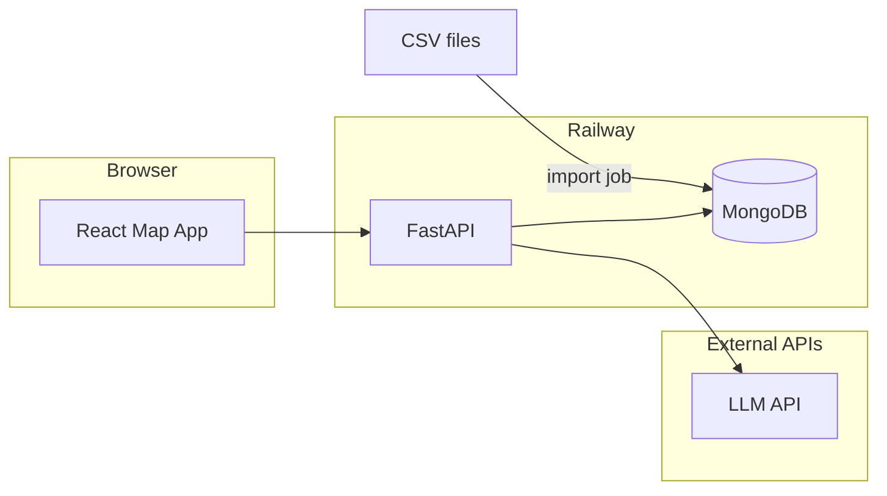

# Implementation Plan: Boston GI Healthcare Map Demo

**Purpose:** End-to-end plan for building the provenance-first healthcare shopping demo as code.  
**Scope (locked for v1):** Boston (city-proper ZIPs), Gastroenterology, Blue Cross Blue Shield of Massachusetts.  
**Data:** Multiple CSV files (schemas finalized as collection proceeds) → MongoDB.  
**Hosting:** Railway.  
**Hero journey:** *“I need a colonoscopy in Boston — where and how much?”* (generalizes to other GI scenarios via CPT bundles).

**Development process:** The **entire** implementation follows **test-driven development (TDD)** — no production logic is added without a failing test first, then minimal code to pass, then refactor. Details are in **§2.1** (Test-driven development — mandatory).

---

## 1. Product summary

### What ships

1. **Intake:** Collect logistics (insurance = BCBS MA, ZIP — treat as sensitive), medical context (symptoms, severity, free text).
2. **Confirmation:** Detect missing required fields; use an LLM only to propose **follow-up questions** and **structured field suggestions** (not prices).
3. **Processing:** Map the confirmed scenario to a **CPT bundle** using your data; compute **min–max (or banded) allowed amounts** per provider from Mongo; apply deterministic **OOP rules** where plan inputs exist (with clear ASSUMED vs FACT tags).
4. **Map UI:** Boston map with filters; user winnows providers; **click a marker** → panel with **price range**, **sources**, **confidence**, **assumptions**.

### What does not ship in v1 (unless time allows)

- Live insurer portal automation (Playwright).
- Real-time pulls from Turquoise/DoltHub/NPPES in production (CSV snapshot is enough for demo).
- Booking, auth, or PHI storage beyond minimal session state.

---

## 2. High-level architecture



- **Single source of runtime truth:** MongoDB populated from CSVs.
- **Backend** owns all business rules, joins, and provenance assembly.
- **Frontend** is presentation, filters, and map interactions; no secret keys in the client.

### 2.1 Test-driven development (TDD) — mandatory

**Policy:** Every feature, bugfix, and refactor in this project uses **Red → Green → Refactor**.

1. **Red:** Write a **failing** automated test that specifies the desired behavior (unit, integration, or contract-level as appropriate). Run it and confirm it fails for the right reason.
2. **Green:** Write the **smallest** amount of application code that makes the test pass. Run the full relevant test suite.
3. **Refactor:** Clean up implementation and tests while **keeping all tests green**.

**Scope of “whole development process”:**

| Area | TDD expectation |
|------|-----------------|
| **Pure logic** (OOP math, scenario→bundle rules, pricing min/max, provenance assembly, intake validation) | **Unit tests first** — pytest (backend); colocated `*.test.ts` / `*.spec.ts` or `__tests__/` (frontend) for reducers, formatters, filter helpers. |
| **API behavior** | **Integration tests** with TestClient (FastAPI) against an **in-memory or test Mongo** (e.g. mongomock, or ephemeral Docker Mongo) — define request/response contracts before route bodies are fully implemented. |
| **CSV import** | Tests on **sample fixtures** in `data/samples/` — expected document counts and field values after import. |
| **LLM confirmation** | **No live LLM in unit tests** — inject a fake client that returns canned JSON; tests assert validation, merging, and error handling. Optional one **manual** or **marked slow** integration test with a real key if needed. |
| **React UI** | **Testing Library** (and Vitest): render + user events; test behavior and accessibility, not implementation details. For map-heavy views, test **container components** and **data hooks** with mocked map SDK; smoke E2E optional (Playwright) for demo path only. |

**CI:** Every push / PR runs **backend `pytest`** and **frontend `vitest`/`npm test`** (and lint if configured). Failing tests block merge.

**Exceptions (still test-backed, not “no tests”):**

- **Spikes / prototypes:** Time-boxed branches may sketch code **only** to learn an API; throwaway spike code **does not ship**. Merged code always arrives via TDD.
- **Third-party / visual-only:** Configuring a map style token is not TDD’d; **wrappers** that parse API responses or build GeoJSON **are**.

---

## 3. Recommended repository layout

```
yhack/
├── README.md                 # how to run locally + env vars
├── implementation-plan.md    # this file
├── data/
│   ├── raw/                  # gitignored or sample-only; real CSVs per team policy
│   └── samples/              # tiny fake CSVs for CI/dev
├── scripts/
│   └── import_csv_to_mongo.py   # (or .ts) idempotent upserts
├── backend/
│   ├── app/
│   │   ├── main.py
│   │   ├── config.py
│   │   ├── models/           # Pydantic request/response & domain types
│   │   ├── routes/
│   │   ├── services/
│   │   │   ├── intake.py
│   │   │   ├── confirmation_llm.py
│   │   │   ├── scenario_to_bundle.py
│   │   │   ├── pricing.py
│   │   │   └── provenance.py
│   │   └── db/
│   ├── tests/                # pytest: unit + integration (mirror app/ structure)
│   ├── requirements.txt
│   ├── requirements-dev.txt # pytest, httpx, mongomock or testcontainers, etc.
│   ├── Dockerfile
│   └── railway.toml          # optional
├── frontend/
│   ├── src/
│   │   ├── components/
│   │   ├── pages/
│   │   ├── api/              # typed fetch wrappers
│   │   ├── hooks/
│   │   └── types/            # colocate *.test.tsx (Vitest + Testing Library) or use __tests__/
│   ├── package.json
│   ├── vite.config.ts
│   └── Dockerfile            # optional static nginx
└── docker-compose.yml        # optional: local API + Mongo
```

Adjust names to taste; keep **data import** separate from **API** so you can re-run imports without redeploying app code.

---

## 4. Data layer

### 4.1 CSV strategy (schemas TBD)

Until columns are fixed, standardize on these **conventions**:

| Convention | Why |
|------------|-----|
| Every row has a **`source`** or file-level metadata stored at import | Provenance in API responses |
| Stable surrogate keys where natural keys are messy | Idempotent upserts |
| Dates as ISO strings; money as decimal or integer cents (pick one) | Avoid float bugs |
| One CSV “topic” per collection **or** merge in import | Easier reasoning |

**Likely CSV families** (rename to match what you collect):

- **Providers:** NPI, name, address, city, ZIP, lat, lng, taxonomy, phone, optional hospital affiliation, display flags.
- **Procedures / bundles:** `bundle_id`, human label, list of CPT/HCPCS codes, clinical tags (e.g. screening vs diagnostic).
- **Prices:** provider or facility key, code or bundle_id, min_rate, max_rate, or single negotiated rate + optional percentile fields, `payer` (BCBS MA), `source` (mrf, turquoise_cache, fair_health_cache, mock).
- **Insurers / plan stubs:** deductible, coinsurance, copay templates for demo plans (even if BCBS-only with 2–3 mock plan archetypes).

### 4.2 MongoDB collections (v1 target)

Align with your data explorer narrative; refine field names when CSVs exist.

| Collection | Role |
|------------|------|
| `providers` | Geo + identity + GI taxonomy; indexes for ZIP, hospital, NPI |
| `procedures` | CPT bundles and metadata for scenario mapping |
| `prices` | Join keys to providers/procedures; min/max; source; confidence |
| `insurers` | BCBS MA + demo plan parameters |

**Indexes (minimum):**

- `providers.location` **2dsphere** if using GeoJSON `Point`.
- Compound: `{ taxonomy: 1, zip: 1 }` or equivalent filters you expose.
- `prices`: `{ provider_id: 1, bundle_id: 1 }` or `{ npi: 1, cpt: 1 }` depending on schema.

### 4.3 Import pipeline

1. **Script** reads each CSV, validates required columns (fail fast with a clear error).
2. **Upsert** by deterministic key (e.g. `npi` + `cpt` + `source` + `effective_date`).
3. **Log counts** per file; optional dry-run mode.
4. Run **locally** during development; on Railway run as **one-off** or **release phase** after deploy, or commit pre-built Mongo dump if hackathon time is tight (not ideal for iteration).

**TDD:** For each new CSV shape or validation rule, add a **failing test** that runs the importer against `data/samples/` and asserts Mongo contents **before** expanding production import code.

---

## 5. Backend (FastAPI)

### 5.1 Configuration

- `MONGODB_URI` (Railway plugin or Atlas).
- `LLM_API_KEY` + model name.
- `CORS_ORIGINS` for frontend URL on Railway.
- Optional: `MAPBOX_TOKEN` if you proxy map tiles (usually token stays in frontend only).

### 5.2 Session / state model

For a hackathon, avoid building full user accounts.

- **Option A:** Stateless — frontend sends full `intake` + `confirmed` payload on each estimate request.
- **Option B:** **Server session** — `POST /sessions` returns `session_id`; store JSON in Mongo `sessions` collection with TTL index (e.g. 24h).

Option B simplifies the map step (one id, refetch estimates). Option A is simpler to implement first.

### 5.3 API endpoints (suggested)

| Method | Path | Purpose |
|--------|------|---------|
| `POST` | `/api/intake` | Accept logistics + medical fields; validate; return normalized object + server-side “missing required” list |
| `POST` | `/api/confirm` | Body: current fields; optional `session_id`. Returns `{ missing_fields, follow_up_questions[], suggested_updates }` — **LLM-assisted** but validated against a strict JSON schema |
| `POST` | `/api/confirm/apply` | Merge user answers; final validation before processing |
| `POST` | `/api/estimate` | Map scenario → `bundle_id` → query `prices` + `providers`; return **FeatureCollection** or split `{ providers[], estimates[] }` |
| `GET` | `/api/providers` | Query params: `bbox`, `zip`, `hospital`, `in_network_only`, etc. |
| `GET` | `/api/providers/{id}` | Detail + estimate for current session payload (or embed in list response) |
| `GET` | `/api/health` | Railway healthcheck |

**Response shape for estimates (every number explainable):**

```json
{
  "provider_id": "...",
  "allowed_amount_range": { "min": 0, "max": 0, "currency": "USD" },
  "oop_range": { "min": 0, "max": 0 },
  "provenance": [
    { "field": "allowed_amount_max", "source": "turquoise_cache", "confidence": 0.8, "kind": "FACT" }
  ],
  "assumptions": ["deductible not met — scenario A"]
}
```

### 5.4 Scenario → CPT bundle (deterministic)

1. Define an internal **`scenario_id`** enum or lookup table (e.g. `colonoscopy_screening`, `colonoscopy_diagnostic`, `egd_with_biopsy`).
2. **Rules first:** symptom keywords + severity + age band (if collected) → `bundle_id`. Start with a **small decision table** in code or Mongo `scenario_rules` collection.
3. **LLM optional fallback:** only to classify free text → `scenario_id` **from a closed set**; if confidence low, ask a disambiguation question in confirmation.

### 5.5 Pricing aggregation (deterministic)

1. Load all price rows for `(provider_keys, bundle_or_cpts)` from `prices`.
2. Compute **min** and **max** across lines or sources per your business rule (e.g. prefer BCBS MRF if present, else fallback chain — mirror your data explorer priority table).
3. Attach **provenance** per chosen source; if multiple sources merged, return **bands** or **primary + alternates**.

### 5.6 OOP engine (deterministic)

Implement the formula from your product docs (insured path), e.g. deductible + coinsurance after deductible, capped by OOP max. For demo:

- If deductible remaining unknown → return **two labeled scenarios** (“deductible met” / “deductible not met”) instead of one misleading number.

### 5.7 LLM integration (`confirmation_llm.py`)

- **Input:** schema of known fields + allowed questions + what is still missing.
- **Output:** strict JSON (use JSON mode / tool use); **validate** with Pydantic; discard hallucinated keys.
- **Never** let the model invent rates; it only proposes **questions** and **normalized field values** you whitelist.

---

## 6. Frontend (React)

### 6.1 Stack

- **Vite + React + TypeScript**
- **TanStack Query** for server state (optional but helpful)
- **Map:** Mapbox GL JS **or** Google Maps JavaScript API — pick one and stick to it for the weekend
- **UI:** minimal component library (e.g. Radix + Tailwind) for speed

### 6.2 Screen flow

1. **Step 1 — Intake form:** ZIP, plan selection (BCBS demo plans), symptoms/severity, free text.
2. **Step 2 — Confirmation:** show missing fields; render LLM-suggested questions as short forms; user confirms/edits.
3. **Step 3 — Map:** Boston default viewport; **filters** (hospital, distance, optional “has price from source X”); **markers**; **selected provider drawer** with min–max, provenance list, assumptions, disclaimer copy.

### 6.3 Map behavior

- **Initial load:** `GET /api/providers?bbox=...` or load all Boston providers if count stays ~O(100).
- **Filtering:** client-side if payload small; server-side if you grow beyond that.
- **Click marker:** show panel; if estimates not embedded in list, `GET /api/providers/{id}` with session context.

### 6.4 Copy and compliance (UX)

- No binary “in-network guaranteed” — use confidence + source + date if available.
- Always show **“call to verify”** style disclaimer for demo.

---

## 7. Railway deployment

### 7.1 Services

1. **Web service:** FastAPI (Dockerfile or Nixpacks build from `backend/`).
2. **MongoDB:** Railway MongoDB plugin **or** MongoDB Atlas (whitelist Railway egress IPs if required).
3. **Frontend:**  
   - **Static site** on Railway, or  
   - Serve built `frontend/dist` from FastAPI (single service, simpler for demos).

### 7.2 Environment variables

Set in Railway dashboard: `MONGODB_URI`, `LLM_API_KEY`, `CORS_ORIGINS`, any proxy secrets.

### 7.3 Post-deploy

- Run **CSV import** once per data refresh.
- Verify `/api/health` and a smoke test: intake → confirm → map loads with markers.

---

## 8. Implementation phases (ordered)

Each phase **starts with tests** (Red) and is **done** only when new tests pass in CI (Green) and code is refactored as needed.

| Phase | Deliverable | Exit criteria |
|-------|-------------|----------------|
| **0** | Repo skeleton, README, sample CSVs | **Tests:** importer fixture tests fail until script exists, then pass; CI runs pytest + Vitest on empty or smoke suites |
| **1** | Mongo schemas + import + seed data | **Tests:** import tests assert post-import counts/fields; repository or query helpers covered by unit/integration tests |
| **2** | FastAPI read APIs + geo query | **Tests:** TestClient tests for `/api/providers` (and health) against test DB; map can plot points from API |
| **3** | Intake + validation (no LLM) | **Tests:** unit tests for validation rules; API tests for `/api/intake` missing-field responses |
| **4** | LLM confirmation step | **Tests:** fake LLM client; tests for schema validation and merge logic; no required dependency on live API in CI |
| **5** | Scenario → bundle + min/max estimates | **Tests:** table-driven tests for scenario→bundle and pricing/OOP; API tests for `/api/estimate`; UI tests for marker panel behavior |
| **6** | Polish + Railway | **Tests:** CI green; optional one E2E smoke; public URL demo end-to-end |

Parallelize **Phase 2** (map) with **Phase 3** (forms) if two devs are available — each stream **still** follows TDD on its own branch.

---

## 9. Testing and QA (TDD execution)

This section is the **operational** companion to **§2.1**. Tests are not an afterthought — they **drive** development.

- **Backend:** `pytest` — **table-driven** cases for pricing aggregation, OOP math, provenance tags, and intake rules. Prefer **pure functions** in `services/` so tests do not need a running server.
- **API:** `httpx.AsyncClient` or Starlette `TestClient` with **test Mongo**; one test per meaningful status code and response shape.
- **Import:** tests run the importer against `data/samples/` and assert resulting documents (counts, required keys, geo types).
- **LLM:** **always** mock in automated tests; optional `@pytest.mark.integration` or manual script with real key for demo rehearsal.
- **Frontend:** **Vitest** + **Testing Library** — user-centric tests for forms, confirmation step, and provider panel; mock `fetch`/API module for map data.
- **QA / demo night:** short **manual smoke checklist** (ZIP, filter, marker click, empty states) **in addition to** automated suites, not instead of them.

---

## 10. Risks and mitigations

| Risk | Mitigation |
|------|------------|
| CSV schemas drift mid-hackathon | Versioned import config (`manifest.yaml` mapping column → field) |
| Sparse BCBS per-provider prices | Fallback chain + clearly labeled MOCK or wide band |
| LLM suggests invalid fields | Closed schema + Pydantic validation + retry |
| Map token / CORS issues | Single origin or proxy; document env in README |

---

## 11. Documentation to keep updated

- **README:** local dev (Docker Compose optional), env vars, import command, Railway deploy notes, **`pytest` / `npm test` commands** and CI expectations (TDD).
- **Data dictionary:** when CSVs land, one table per file: column → Mongo field → meaning.

---

## 12. Success criteria (demo)

1. User completes intake + confirmation without console errors.
2. Map shows Boston GI providers with working filters.
3. Selecting a provider shows **min–max** (or dual scenario) with **source** and **FACT vs ASSUMED**.
4. App runs on **Railway** with Mongo-backed data (not hardcoded in frontend).
5. **CI passes** (pytest + frontend tests): shipped behavior is covered by tests written via TDD.

---

*This plan intentionally defers exact CSV columns until data collection finishes; the import manifest + Pydantic models are the right place to encode those details when ready.*
